<div align="center">


# Farmácia Vigor

**Controle de injeções e tratamentos para farmácia — em uso real, no dia a dia da Farmácia Vigor.**


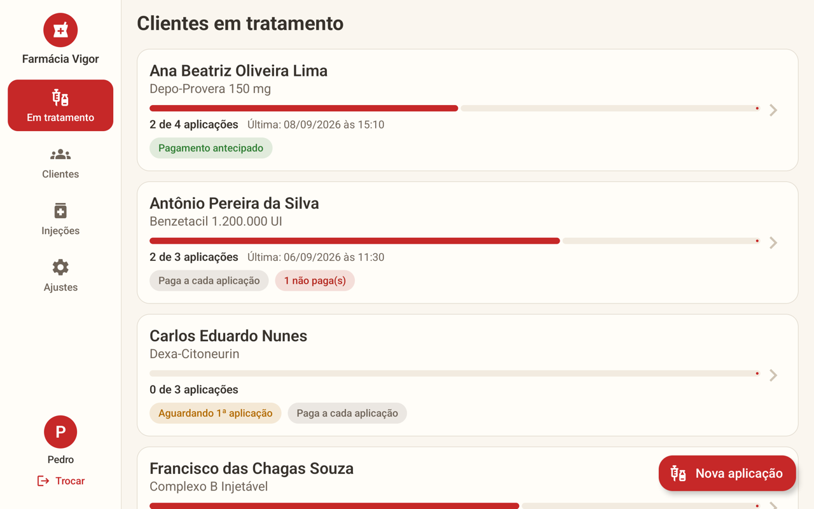

</div>

> [!IMPORTANT]
> **Este não é um projeto de portfólio parado na gaveta.** O app está **em uso real na Farmácia Vigor**: roda no tablet compartilhado pelos atendentes (Samsung Galaxy Tab S6 Lite) e é onde a farmácia registra cada injeção aplicada nos clientes, acompanha os tratamentos em andamento e controla o que já foi pago.
>
> _Todos os prints deste README usam **dados fictícios** — nenhum dado de cliente real aparece aqui._

---

## 💉 O problema

Muitos tratamentos injetáveis têm **várias doses** espalhadas ao longo de dias, semanas ou meses — e cada dose pode ser aplicada por um atendente diferente, paga na hora ou já quitada na compra. O app responde, em segundos, às perguntas do balcão:

- **Quantas doses esse cliente já tomou — e quantas faltam?**
- **Quem aplicou e quando?**
- **Está tudo pago ou ficou alguma aplicação pendente?**
- **Quem comprou o tratamento e ainda não veio tomar a primeira dose?**

## ✨ Funcionalidades

### 📋 Tratamentos
- **Painel de clientes em tratamento** com barra de progresso (`2 de 4 aplicações`), data da última aplicação e etiquetas de situação.
- **Tratamento automático:** é aberto na primeira aplicação de um par cliente + injeção e **se encerra sozinho** quando todas as doses são aplicadas.
- **"Só abrir o tratamento":** registra o que o cliente comprou para aplicar depois — ele aparece como _Aguardando 1ª aplicação_.
- Encerramento manual a qualquer momento, sem perder o histórico.

### 💰 Pagamentos
- Dois modos: **pagou tudo antecipado** ou **paga a cada aplicação**.
- Aplicações não pagas ficam destacadas e podem ser **marcadas como pagas** depois, direto no histórico.

### 👥 Clientes
- Cadastro com nome, **CPF validado** (dígitos verificadores), data de nascimento com **idade calculada**, sexo e telefone — **toque no telefone para ligar**.
- **Busca por nome ou CPF** tolerante a acentos ("Jose" encontra "José") e aviso de cadastro repetido.
- **Histórico completo** de aplicações: injeção, data, hora e quem aplicou.

### 🧪 Injeções
- Nome comercial, laboratório, **composições e miligramagens**, quantidade de aplicações do tratamento.
- **Foto da caixa** pela câmera ou galeria, com zoom de pinça — ajuda a achar o produto certo na prateleira.

### 🧑‍⚕️ Feito para o balcão
- **Quem está atendendo?** O tablet é compartilhado: cada atendente se identifica e toda aplicação fica registrada com o nome de quem aplicou.
- **Letras e botões grandes** e **zoom da tela ajustável** — pensado para atendentes e clientes de todas as idades.
- **Tela cheia**, sem distrações, e layout que se adapta a **tablet e celular**.

### 🛟 Dados seguros
- **100% offline:** sem servidor e sem mensalidade; os dados ficam no próprio tablet.
- **Backup em um único arquivo `.zip`** (banco + fotos) para guardar no Google Drive — a restauração valida o arquivo antes de substituir qualquer coisa.
- **Backup automático do Android** na conta Google do tablet, restaurado sozinho ao reinstalar o app.

## 📸 Telas

<table>
  <tr>
    <td width="50%">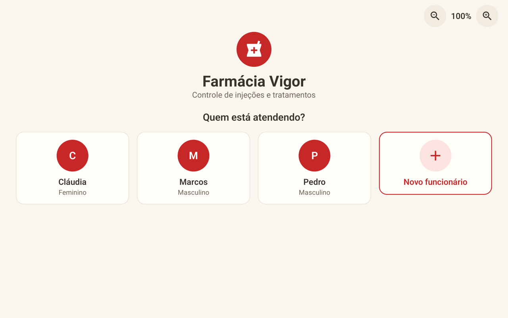</td>
    <td width="50%">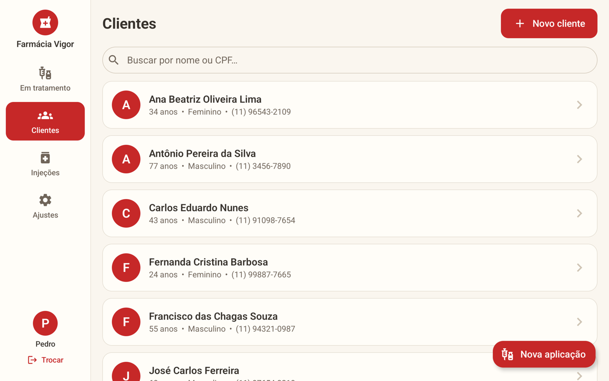</td>
  </tr>
  <tr>
    <td align="center"><b>Quem está atendendo?</b><br><sub>Cada atendente se identifica no tablet compartilhado</sub></td>
    <td align="center"><b>Clientes</b><br><sub>Busca por nome ou CPF</sub></td>
  </tr>
  <tr>
    <td>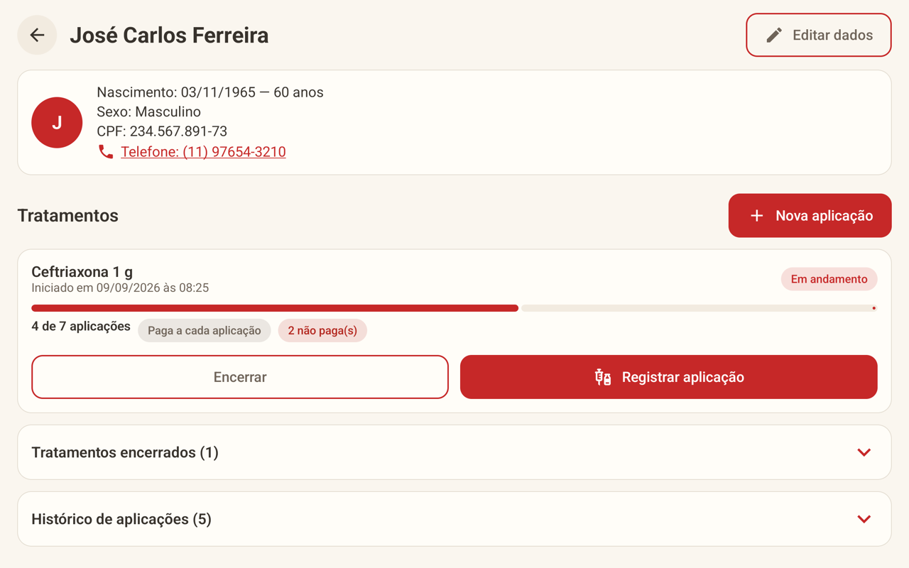</td>
    <td>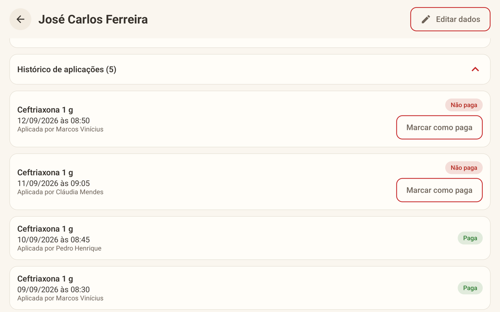</td>
  </tr>
  <tr>
    <td align="center"><b>Ficha do cliente</b><br><sub>Tratamentos em andamento, pendências e ações rápidas</sub></td>
    <td align="center"><b>Histórico de aplicações</b><br><sub>Quem aplicou, quando e o que falta pagar</sub></td>
  </tr>
  <tr>
    <td>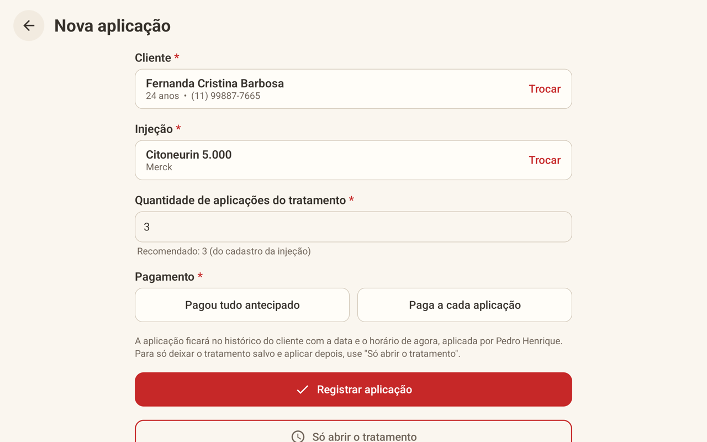</td>
    <td>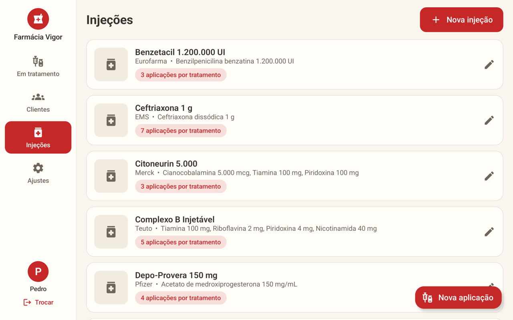</td>
  </tr>
  <tr>
    <td align="center"><b>Nova aplicação</b><br><sub>Cliente, injeção, doses e forma de pagamento</sub></td>
    <td align="center"><b>Injeções</b><br><sub>Composição, laboratório e doses por tratamento</sub></td>
  </tr>
  <tr>
    <td>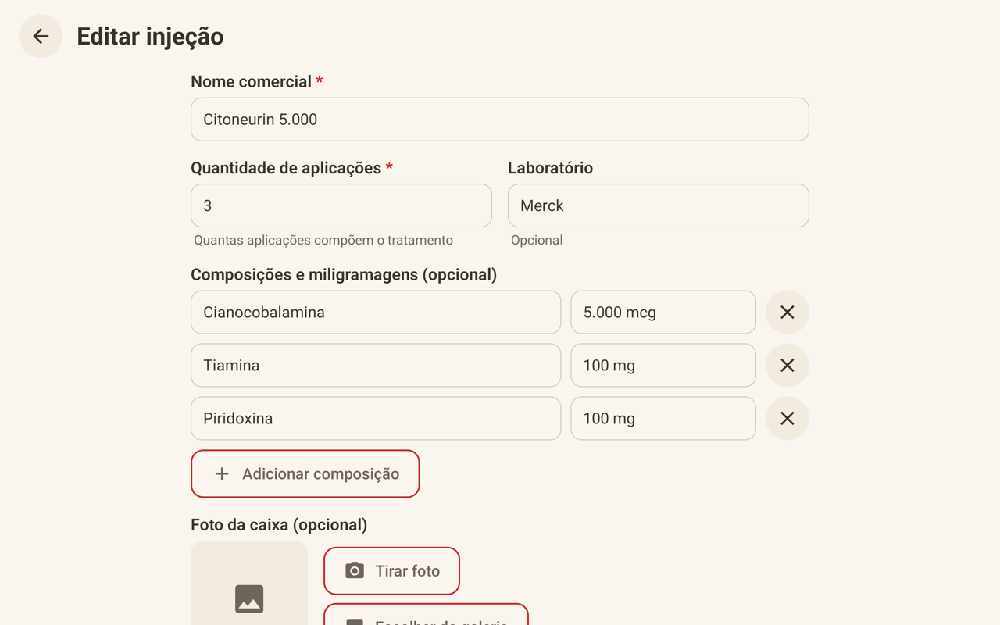</td>
    <td>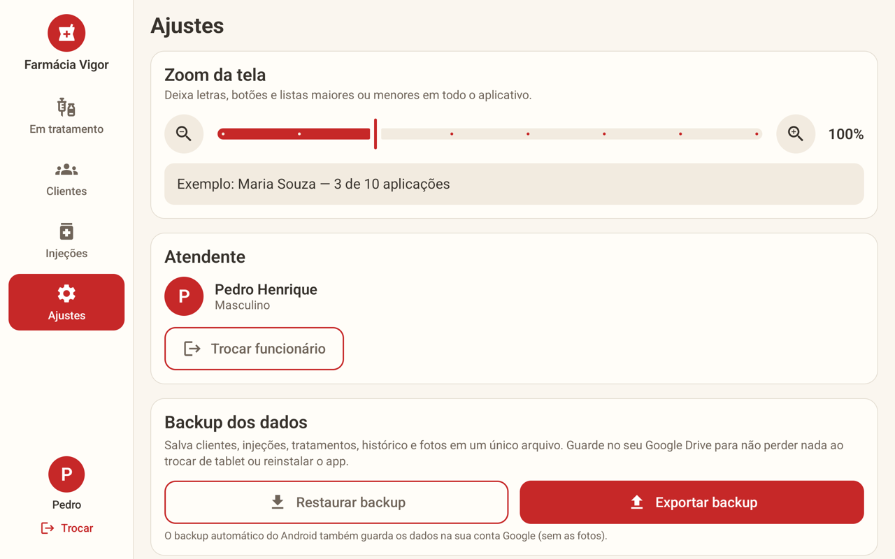</td>
  </tr>
  <tr>
    <td align="center"><b>Cadastro de injeção</b><br><sub>Composições, miligramagens e foto da caixa</sub></td>
    <td align="center"><b>Ajustes</b><br><sub>Zoom da tela, troca de atendente e backup</sub></td>
  </tr>
</table>

### 📱 Também no celular

<table>
  <tr>
    <td width="30%">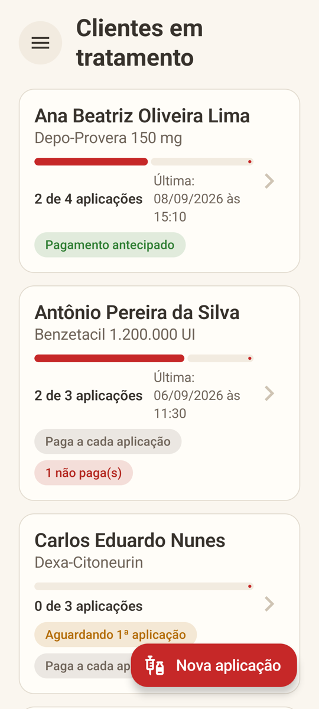</td>
    <td width="30%">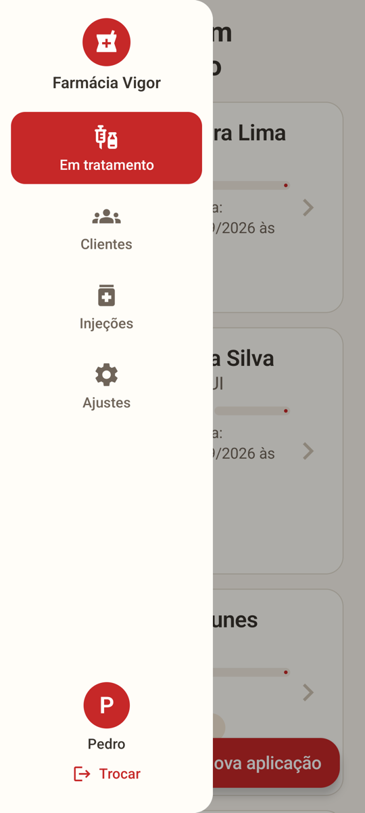</td>
    <td>
      O dispositivo principal é o tablet, mas o layout se adapta a telas menores: no celular a barra lateral vira um <b>menu gaveta</b> e os botões do cabeçalho ficam compactos.
    </td>
  </tr>
</table>

## 🛠️ Tecnologias

| | |
|---|---|
| **Linguagem** | Kotlin 2.2 |
| **Interface** | Jetpack Compose + Material 3 |
| **Banco de dados** | Room (SQLite) com KSP |
| **Build** | Gradle 9.4 + Android Gradle Plugin 9.2 (version catalog) |
| **Android** | `minSdk` 31 (Android 12) · `targetSdk` 36 |

**Arquitetura enxuta de propósito:** uma única Activity, navegação própria com pilha de telas e `AnimatedContent`, DAOs expondo `Flow` coletados direto pela UI e a regra de negócio transacional concentrada em um `Repositorio`. Todo o código — pacotes, classes, funções e textos — é escrito em **português**.

```
app/src/main/java/com/farmaciavigor/app/
├── MainActivity.kt        # Activity única, zoom, tela cheia
├── Nucleo.kt              # Navegador (pilha de telas) e sessão do atendente
├── dados/                 # Entidades, DAOs, banco Room e Repositorio
├── ui/
│   ├── comum/             # Componentes de toque grande reutilizáveis
│   ├── tema/              # Paleta off-white + vermelho e tipografia ampliada
│   └── telas/             # Telas do app
└── util/                  # Backup, fotos e formatação (CPF, datas, telefone)
```

## 🚀 Como rodar

Pré-requisito: **Android Studio** recente (com suporte ao AGP 9).

```bash
# Compilar o APK de debug
./gradlew :app:assembleDebug

# Instalar em um aparelho ou emulador conectado
adb install -r app/build/outputs/apk/debug/app-debug.apk
```

Ou simplesmente abra a pasta no Android Studio e clique em **Run ▶**.

---

<div align="center">

Desenvolvido por [Pedro Cabral](https://github.com/phsilvacabral) para a **Farmácia Vigor** 💊

</div>
